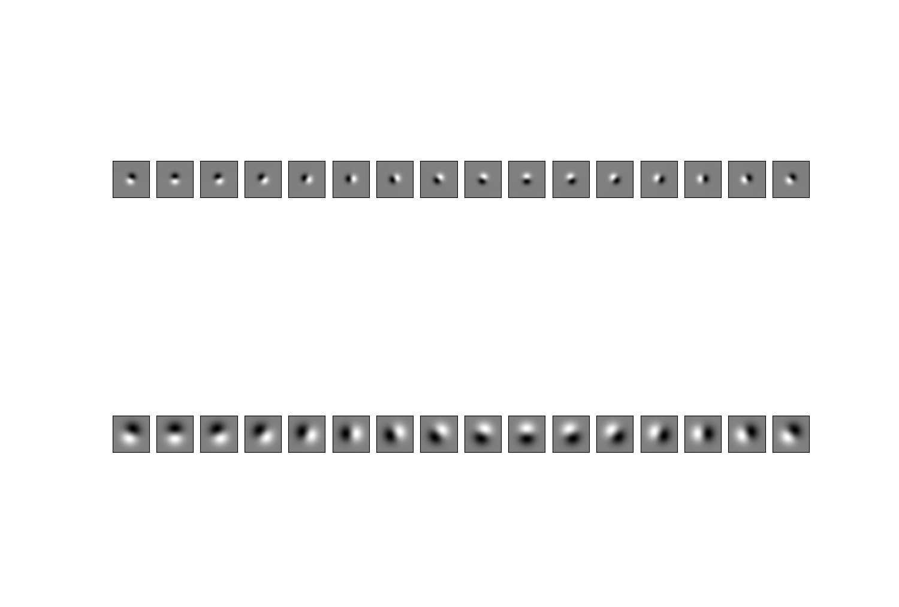
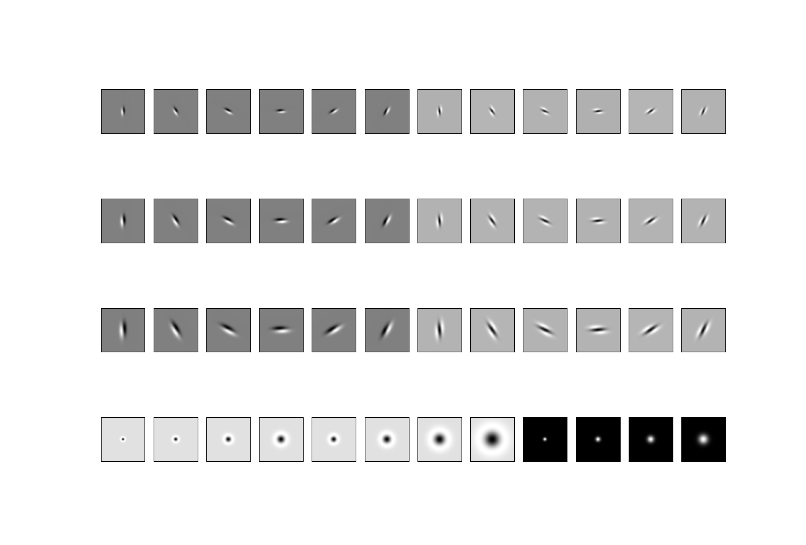
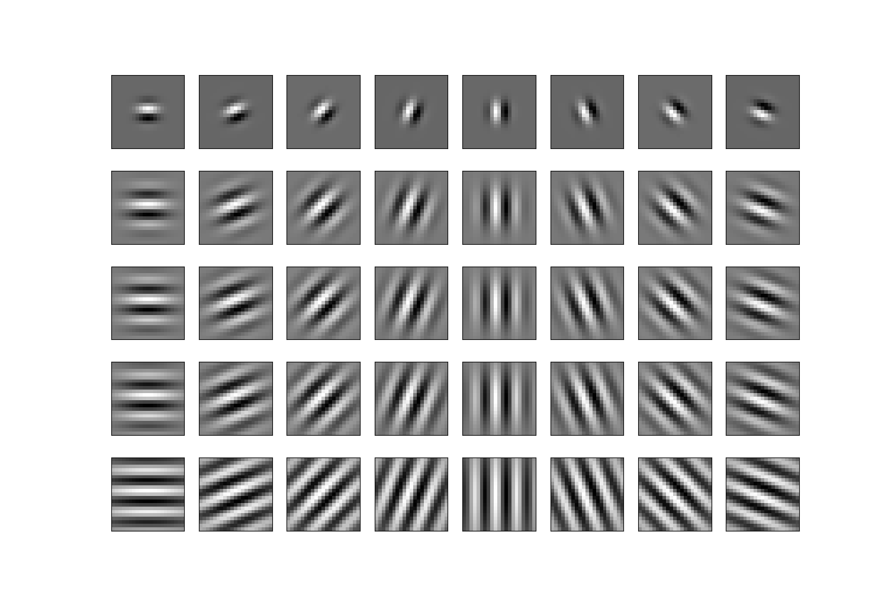
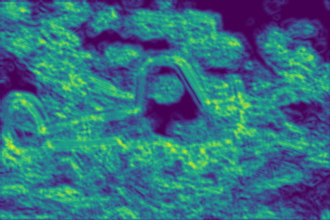
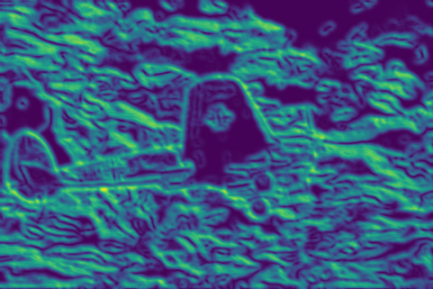
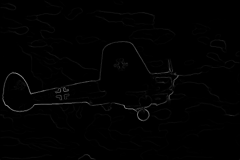

# PbLite Boundary Detection

---

## About
Boundary detection is an important, well-studied computer vision problem. A simple method to find boundaries is to look for 
intensity discontinuities in the image, also known of edges. Classical edge detection algorithms, including the Canny and Sobel 
baselines, look for these intensity discontinuities. The more recent pb (probability of boundary) boundary detection algorithm 
significantly outperforms these classical methods by considering texture and color discontinuities in addition to intensity 
discontinuities. Qualitatively, much of this performance jump comes from the ability of the pb algorithm to suppress false positives 
that the classical methods produce in textured regions. This project is a simplified version of pb, which finds boundaries by examining 
brightness, color, and texture information across multiple scales (different sizes of objects/image). The output of the algorithm is a 
per-pixel probability of boundary which outperforms the Canny and Sobel Edge Detectors.

## Details
Input image

Derivative of Gaussian Filter (DoG), Leung-Malik Filter (LM) and Gabor Filter Banks:

  
  
  

Texton, Brightness and Color Gradient maps:

  
  
  

## Results:
Sobel, Canny, and PbLite edge detections

  
  
  

## Libraries Required:
1. Numpy
2. OpenCV
3. Matplotlib
4. Scikit-Learn
